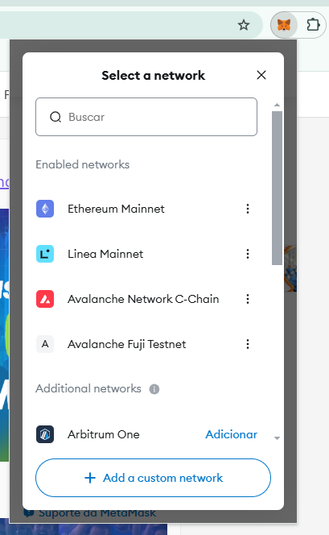
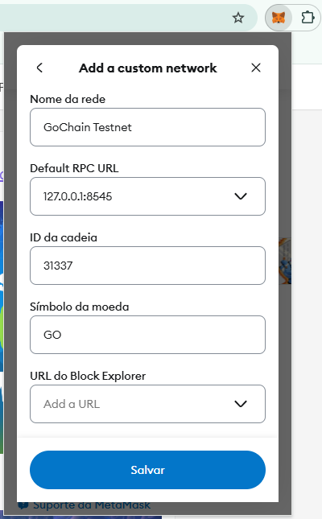

# Votacao

Este repositório contém um projeto baseado no repositório [Hardhat Beginners Tutorial](https://hardhat.org/tutorial) da Hardhat, com a implementação de um DApp capaz de executar uma votação para os trabalhos da disciplina de Blockchain da UFES.

## Início Rápido

### Instalação da versão correta do Node.js:

```sh
nvm install 18
```

```sh
nvm use 18.20.6
```

### Clonando o repositório

```sh
git clone https://github.com/arthurcoelho442/Votacao.git
```
```sh
cd Votacao
```
```sh
npm install
```

### Executando a rede de testes do Hardhat

```sh
npx hardhat node
```

Em outro terminal, faça o deploy dos contratos utilizando o script:

```sh
npx hardhat run scripts/deploy.js --network localhost
```

### Executando o front-end

```sh
cd frontend
```
```sh

npm install
```
```sh
npm start
```

Abra [http://localhost:3000/](http://localhost:3000/) para visualizar o DApp. 
Você precisará ter o [Coinbase Wallet](https://www.coinbase.com/wallet) ou [Metamask](https://metamask.io) instalado e conectado à rede `localhost:8545`.

## Conexão com a rede Hardhat via MetaMask

Instale a [extensão MetaMask](https://chrome.google.com/webstore/detail/metamask/nkbihfbeogaeaoehlefnkodbefgpgknn?hl=en), recomendado utilizar o navegador Chrome. Para configuração da conta MetaMask, é necessário criar uma nova carteira e fazer backup da frase de segurança.  

Após a criação da carteira MetaMask, basta clicar no ícone da MetaMask, onde é possível observar que a conexão padrão está configurada para a rede Mainnet Ethereum. Logo, é necessário alterar para conectar à rede local de Hardhat no MetaMask.  

1. Certifique-se de configurar suas redes de teste para serem visíveis. Navegue até as configurações da MetaMask, vá até configurações avançadas e defina a rede de teste a ser conectada.  

2. Vá até suas configurações de rede e clique em **Adicionar nova rede**.  

  <div style="text-align: center;">
    
  </div>  

3. Preencha as informações necessárias e salve.  

  <div style="text-align: center;">
    
  </div>

## Solução de Problemas

- **Erros de `Invalid nonce`**: Se você está vendo esse erro no console do `npx hardhat node`, tente redefinir sua conta no Metamask. Isso irá limpar o histórico de transações e o nonce da conta. Para isso:
  - Abra o Metamask
  - Clique na sua conta
  - Acesse `Configurações > Avançado > Limpar dados da aba de atividades`